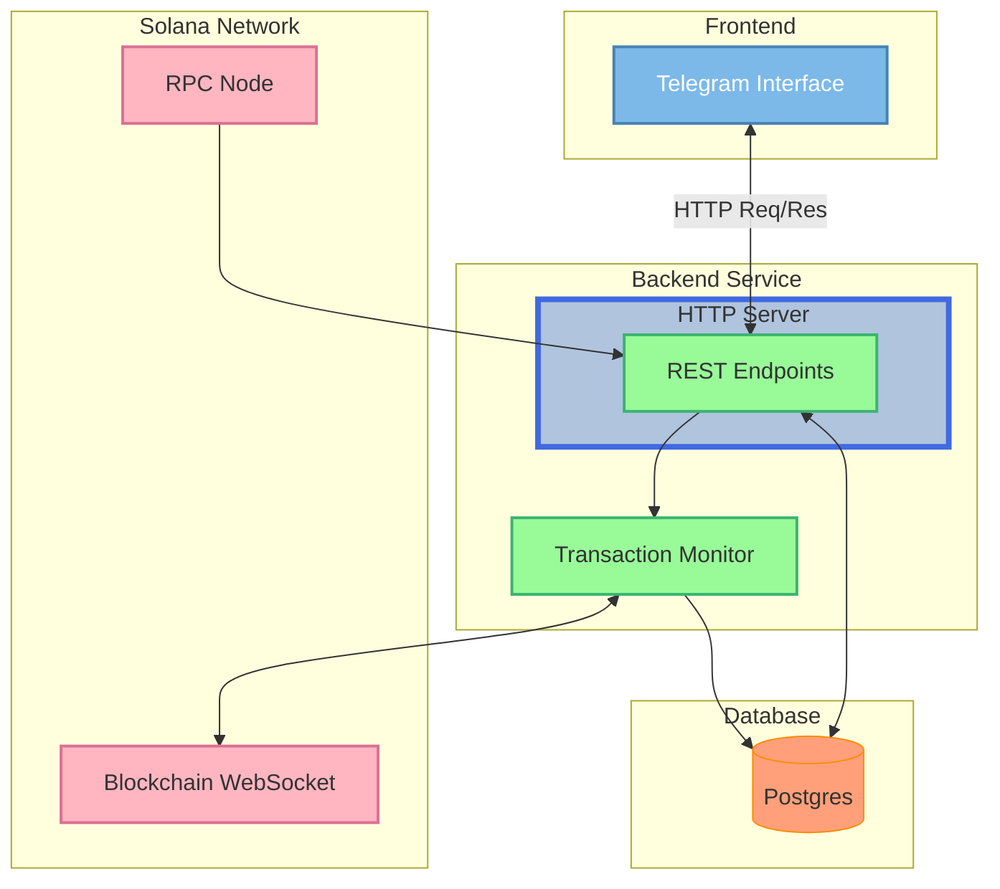

# aura Architecture

```mermaid
flowchart TD
    subgraph UI[Frontend]
        WEB[Telegram Interface]
    end

    subgraph Backend[Backend Service]
        subgraph HTTP_SERVER[HTTP Server]
            API[REST Endpoints]
        end
        MONITOR[Transaction Monitor]
    end

    subgraph Database[Database]
        DB[(Postgres)]
    end

    subgraph Blockchain[Solana Network]
        RPC[RPC Node]
        BC_WS[Blockchain WebSocket]
    end

    %% Bi-directional Flows
    WEB <--> |HTTP Req/Res| API
    API <--> DB
    RPC --> API
    MONITOR <--> BC_WS
    MONITOR --> DB
    API --> MONITOR

    %% Modern, softer color palette
    classDef frontend fill:#7CB9E8,stroke:#4682B4,stroke-width:2px,color:white
    classDef backend fill:#98FB98,stroke:#3CB371,stroke-width:2px,color:#333
    classDef blockchain fill:#FFB6C1,stroke:#DB7093,stroke-width:2px,color:#333
    classDef database fill:#FFA07A,stroke:#FF8C00,stroke-width:1px,color:#333
    classDef server fill:#B0C4DE,stroke:#4169E1,stroke-width:4px,color:#333
   

    class WEB,API,MONITOR,DB,RPC,BC_WS uniform
    class WEB frontend
    class API,MONITOR backend
    class HTTP_SERVER server
    class RPC,BC_WS blockchain
    class DB database
```