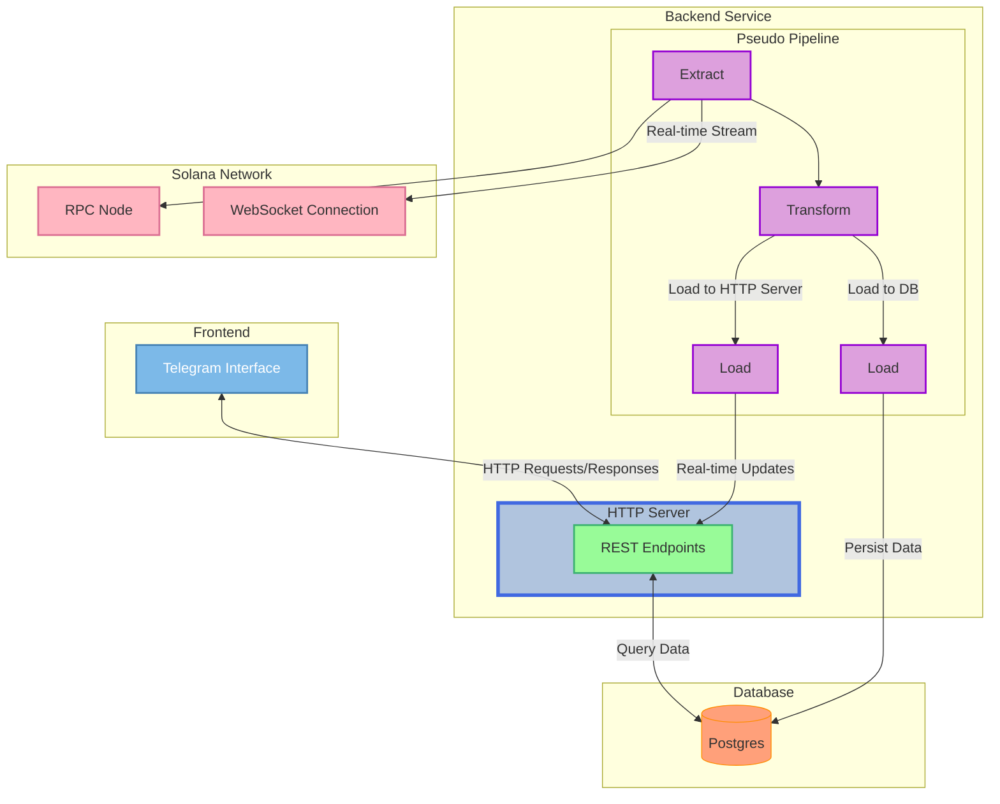

# Aura
Aura is a Solana based onchain data retrieval tool that provides traders with real-time data as well as historic metadata to make data driven decisions when executing trades.

Onchain data is extracted via mainnet RPC node calls, decoding Metaplex PDA data, as well as more optimized RPC calls using Helius.

## Aura Architecture

## Features
- 🔎 Real-time wallet monitoring
- 📊 SPL token and wallet metadata retrieval
- 🖥️ Telegram interface for mobile or desktop based access

## Requirements
- `Go: 1.23.X +`
- [Helius API key](https://dashboard.helius.dev/)

## Quick Start (Locally)
- Below are instructions to set up a local copy of the Go backend server. You’ll need to configure a data store (e.g., PostgreSQL, Redis, or an in-memory solution). 

- The project uses a *Repository Pattern*, so the data store implementation can be swapped without modifying core logic—just replace the repository layer with your preferred storage solution.
```
$ git clone https://github.com/jakobsym/aura.git
$ make
$ ./bin/aura
```

## Usage Example(s)
- Locally you can access specific endpoints of the internal API
    


<user_id> wishes to track <solana_wallet_address>
```
$ curl -X POST localhost:3000/v0/track/<solana_wallet_address> \
    -H "Content-Type: application/json" \
    -d '{
        "user_id" : <user_id>
    }'
```

Receive metadata for <token_address>
```
$ curl -X GET localhost:3000/v0/token/<token_address>

```
Response:
```
{
  "token_address": <token_address>,
  "name": "Solana",
  "symbol": "SOL",
  "created_at": "2024-05-05T06:18:01Z",
  "supply": 926910034.835728,
  "price": 0.00147629,
  "fdv": 1368388.0153276369,
  "socials": "https://x.com/search?q=6yjNqPzTSanBWSa6dxVEgTjePXBrZ2FoHLDQwYwEsyM6"
}
```
